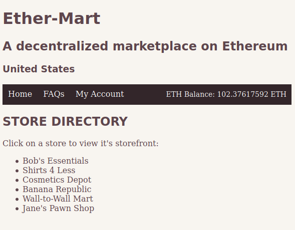

# Ethereum Online Marketplace
> Consensys Academy 2020 Blockchain Developer Bootcamp Final Project

<!-- TABLE OF CONTENTS -->
## Table of Contents

* [About the Project](#about-the-project)
  * [Built With](#built-with)
* [Getting Started](#getting-started)
  * [Prerequisites](#prerequisites)
  * [Installation](#installation)
* [Usage](#usage)
* [License](#license)
* [Acknowledgements](#acknowledgements)

<!-- ABOUT THE PROJECT -->
## About The Project
 An Ethereum Online Marketplace application with web user-interface and smart contract deployed on Rinkeby testnet.
 <p>
 

### Built With

* Truffle
* Ganache-CLI
* Web3.js
* jQuery

<!-- GETTING STARTED -->
## Getting Started

This project was made using Truffle and has a common file structure including a contracts folder, migrations folder, test folder and other main project files.

To get a local copy up and running follow these simple steps.

### Prerequisites

* npm
```sh
npm install npm@latest -g
```

You may also need to install python3 for using 'python3 -m http.server'.

### Installation

1. Clone the repo
```sh
gh repo clone ortegarod/consensys-academy-final-project
```
2. Install NPM packages
```sh
npm install
```
3. Run python local web server (localhost:8000)
```sh
python3 -m http.server
```
4. Open Firefox or Chrome (localhost:8000)


*The project can also be deployed on a local test blockchain such as Ganache-CLI. To deploy to Ganache-CLI, run 'ganache-cli' and then use command 'truffle migrate --network development' and edit abi.js to update the deployed contract address. Open the browser and connect Metamask to Ganache-CLI.

<!-- USAGE EXAMPLES -->
## Usage

This project aims to replicate the experience of an online e-commerce marketplace by using only a smart contract on Ethereum acting as an intemediary between the buyer and seller. The UI is served using simple HTML/JavaScript web pages and web3 to make contract calls. 

The user must have a web3 enabled web browser and Metamask installed (connect to Rinkeby testnet). The smart contract is deployed and functional on the Rinkeby testnet (Rinkeby testnet Ether required).

<a href="https://rinkeby.etherscan.io/address/0x6487a3ce399561674976F933676c0ed40Ec5Bb19">Contract Address (Rinkeby Testnet): 0x6487a3ce399561674976F933676c0ed40Ec5Bb19
</a> 

<!-- LICENSE -->
## License

Distributed under the GNU General Public License (GPLv3). See `LICENSE` for more information.

<!-- ACKNOWLEDGEMENTS -->
## Acknowledgements

* Consensys Academy


